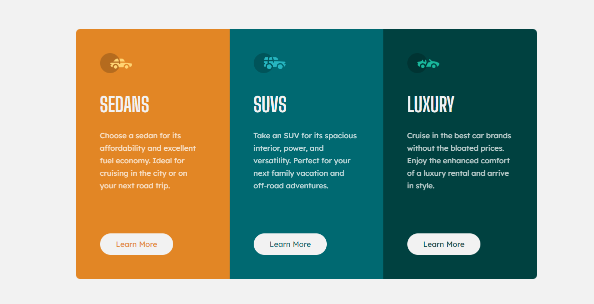
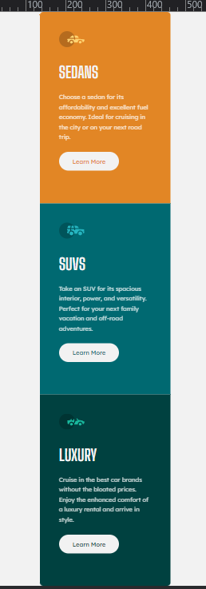

# Frontend Mentor - Order summary card solution

This is a solution to the [3-column preview card component](https://www.frontendmentor.io/challenges/3column-preview-card-component-pH92eAR2-).

## Overview

 

 
 
 

## Screenshot

### Desktop Version

### Mobile Version

### Links

- [Solution in Front End Mentor Site:](https://www.frontendmentor.io/solutions/nft-preview-card-component-7-GfK5bKTr)
- [Live Site](https://3-column-preview-card-component-delta-nine.vercel.app/)

 
 

## My process

Another challenge similar to the previous ones but this time I tried to use new things I'm learning, like improving semantic HTML5 markup, CSS Grid, advanced selectors, custom Properties and Mobile-first workflow.

 
## Author

- Frontend Mentor - [@VitorMagnago](https://www.frontendmentor.io/profile/VitorMagnago)
